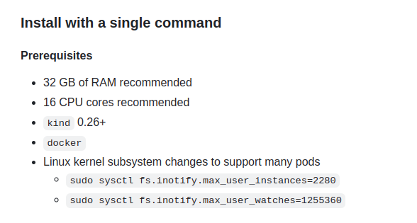
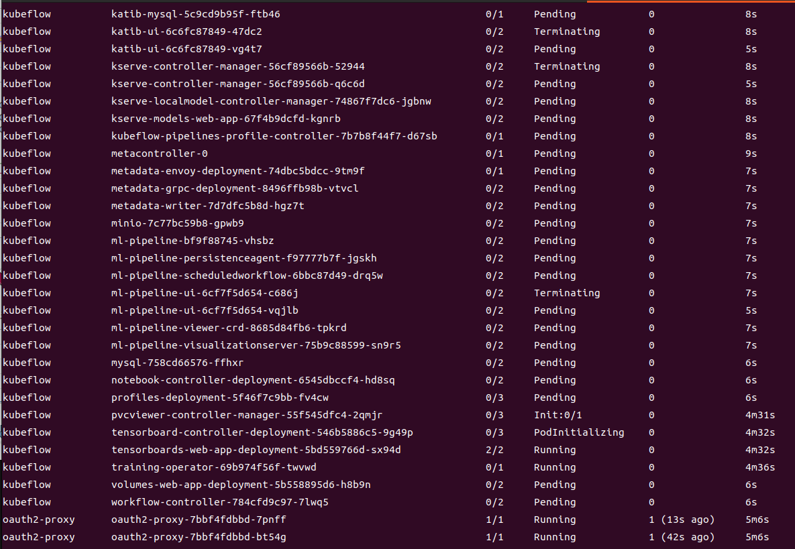

# Install Kubeflow v1.9.1 (All Component)

## Prerequisites

### Resource Requirements (공식 Repository master 참고)


### Version Requirements (공식 Repository master 참고)
- **Kubernetes**: v1.31
- **Kustomize**: v5.2.1++
- **Kubectl**: Kubectl in a version that is compatible with your Kubernetes cluster

### Storage Requirements
- Either our local Kind (installed below) or your own Kubernetes cluster with a default StorageClass
```bash
$ k get sc
NAME                 PROVISIONER                RECLAIMPOLICY   VOLUMEBINDINGMODE   ALLOWVOLUMEEXPANSION   AGE
standard (default)   k8s.io/minikube-hostpath   Delete          Immediate           false                  5d23h
```

## Installation Steps

### 1. Clone Specific Version
```bash
git clone https://github.com/kubeflow/manifests.git
cd manifests

# Verify version
git describe --tags
```

### 2. Verify Prerequisites
```bash
# Check Kubernetes version
$ kubectl version --client
Client Version: v1.31.1

# Check Minikube version
$ minikube version

# Check Kustomize version (should be 5.2.1+)
$ kustomize version
```

### 3-1. Deploy Kubeflow (모든 컴포넌트 설치)(실패)
```bash
# Apply the full installation
while ! kustomize build example | kubectl apply --server-side --force-conflicts -f -; do echo "Retrying to apply resources"; sleep 20; done
```

```bash
# 현재 클러스터 구성상 Kubeflow 모든 컴포넌트 설치 시 리소스 부족으로 인해 배포 불가 
```



```bash
# Kubeflow 개별 컴포넌트 설치 후 각각 예제 구현 및 정리 예정
```

### 3-2. Deploy JupterNotebook (구현중)