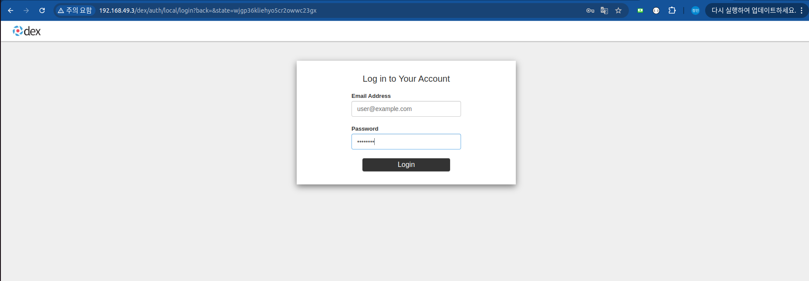
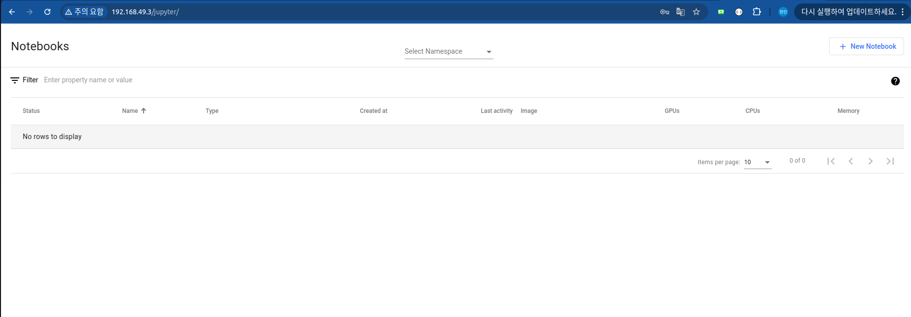
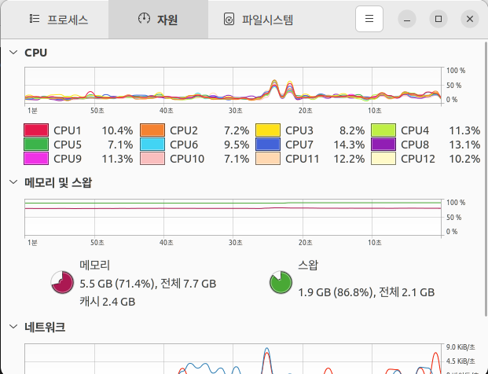

# Jupyter Web App 

## Installation Steps

### 1. Clone Specific Version
```bash
git clone https://github.com/kubeflow/manifests.git
cd manifests

# Verify version
git describe --tags
```

### 2-1. Install cert-manager

```bash
kustomize build common/cert-manager/base | kubectl apply -f -
kustomize build common/cert-manager/kubeflow-issuer/base | kubectl apply -f -
echo "Waiting for cert-manager to be ready ..."
kubectl wait --for=condition=ready pod -l 'app in (cert-manager,webhook)' --timeout=180s -n cert-manager
kubectl wait --for=jsonpath='{.subsets[0].addresses[0].targetRef.kind}'=Pod endpoints -l 'app in (cert-manager,webhook)' --timeout=180s -n cert-manager
```

```bash
k get all -n cert-manager
```

### 2-2. Install Istio

```bash
echo "Installing Istio configured with external authorization..."
kustomize build common/istio-1-24/istio-crds/base | kubectl apply -f -
kustomize build common/istio-1-24/istio-namespace/base | kubectl apply -f -
kustomize build common/istio-1-24/istio-install/overlays/oauth2-proxy | kubectl apply -f -

# global-deny-all라는 AuthorizationPolicy로 모든 트래픽 접근 불가
# 단, istio-ingressgateway라는 AuthorizationPolicy로 istio-ingressgateway label이 있는 워크로드만 접속 가능 

echo "Waiting for all Istio Pods to become ready..."
kubectl wait --for=condition=Ready pods --all -n istio-system --timeout 300s
```

```bash
k get all -n istio-system
```

### 2-3. Create the namespace.

```bash
kustomize build common/kubeflow-namespace/base | kubectl apply -f -
```

```bash
k get ns --show-labels
```
### 2-4. Create the Kubeflow ClusterRoles, kubeflow-view, kubeflow-edit and kubeflow-admin

```bash
kustomize build common/kubeflow-roles/base | kubectl apply -f -
```

### 2-5. Kubeflow Istio Resources (*외부 접속 Gateway 생성)

```bash
kustomize build common/istio-1-24/kubeflow-istio-resources/base | kubectl apply -f -
```

### 2-6. Install the Admission Webhook for PodDefaults

```bash
kustomize build apps/admission-webhook/upstream/overlays/cert-manager | kubectl apply -f -
```

### 2.7 Oauth2-proxy, Dex (인증)

```bash
# Oauth2-proxy
kustomize build common/oauth2-proxy/overlays/m2m-dex-only/ | kubectl apply -f -
kubectl wait --for=condition=ready pod -l 'app.kubernetes.io/name=oauth2-proxy' --timeout=180s -n oauth2-proxy
```

```bash
# Dex
echo "Installing Dex..."
kustomize build common/dex/overlays/oauth2-proxy | kubectl apply -f -
kubectl wait --for=condition=ready pods --all --timeout=180s -n auth
```

### 2-8. Network Policies는 생략 (개발 환경) 

### 2-9. Install the Notebook Controller

```bash
kustomize build apps/jupyter/notebook-controller/upstream/overlays/kubeflow | kubectl apply -f -
```

```bash
k get all -n kubeflow
```

### 2-10. Install the Jupyter Web App

```bash
kustomize build apps/jupyter/jupyter-web-app/upstream/overlays/istio | kubectl apply -f -
```

```bash
k get all -n kubeflow
```

### 2-11. Install the Profile Controller and the Kubeflow Access-Management (KFAM) 

```bash
# Kubeflow 상에서 RBAC 구현을 위한 요소 설치
kustomize build apps/profiles/upstream/overlays/kubeflow | kubectl apply -f -
```

### Metallb (외부 IP 할당)

```bash
# Metallb addons 활성화
mk -p mlopds addons enable metallb
mk -p mlops addons list
k get all -n metallb-system
# LoadBalancer 외부 IP 범위 설정
k apply -f metallb/metallb_config.yaml
```

```bash
k get svc -n istio-system
# Service Type을 LoadBalancer로 바꾸어 외부 IP 할당
k edit svc istio-ingressgateway -n istio-system
k get svc -n istio-system
```

### 4. Check Resources

```bash
# 정렬 옵션
kubectl top nodes --sort-by=cpu     # CPU 사용량으로 정렬
kubectl top nodes --sort-by=memory  # 메모리 사용량으로 정렬

# 추가 정보 표시
kubectl top nodes --show-capacity   # 전체 용량 표시
kubectl top nodes -l key=value      # 라벨로 필터링

# 포맷팅
kubectl top nodes -o json          # JSON 형식
kubectl top nodes -o yaml          # YAML 형식
```

### 5. Authentication Process

```bash
# 1. 외부 접근 시작
사용자가 http://192.168.49.3/jupyter/ 접속
→ 이는 Kubeflow의 Jupyter Notebook UI에 접근하기 위한 URL
```

```bash
# 2. LoadBalancer로 진입
Service: istio-ingressgateway (type: LoadBalancer)
Namespace: istio-system
External-IP: 192.168.49.3
→ 클러스터의 진입점 역할을 하는 서비스
→ 외부 요청을 클러스터 내부로 라우팅하는 첫 관문
```

```bash
# 3. AuthorizationPolicy 정책들 검사 (순서대로)
- AuthorizationPolicy: global-deny-all (namespace: istio-system)
 모든 트래픽 기본 차단
 → 보안을 위해 모든 트래픽을 기본적으로 차단하는 정책

- AuthorizationPolicy: istio-ingressgateway (namespace: istio-system)
 게이트웨이 트래픽 허용
 → istio-ingressgateway를 통한 접근만 허용

- AuthorizationPolicy: istio-ingressgateway-oauth2-proxy (namespace: istio-system)
 인증 필요 여부 확인
 → 인증되지 않은 사용자를 감지하여 OAuth2 인증 프로세스로 리다이렉트
```

```bash
# 4. Gateway 처리
Gateway: kubeflow-gateway (namespace: kubeflow)
→ Kubeflow 전용 게이트웨이
→ 80번 포트로 들어오는 HTTP 트래픽을 처리
→ 트래픽을 적절한 서비스로 라우팅하는 역할
```

```bash
# 5. VirtualService 라우팅 (인증 필요시)
- VirtualService: oauth2-proxy (namespace: oauth2-proxy)
 /oauth2/* 경로로 리다이렉트
 → 인증이 필요한 사용자를 OAuth2 프록시로 안내

- Service: oauth2-proxy (namespace: oauth2-proxy)
 OAuth2 Proxy 파드로 전달
 → 실제 인증 프로세스를 처리하는 서비스
```

```bash
# 6. Dex 인증
- VirtualService: dex (namespace: auth)
 /dex/* 경로로 리다이렉트
 → OAuth2 Proxy가 Dex로 인증 요청을 전달

- Service: dex (namespace: auth)
 → 실제 로그인 페이지 제공
 → 사용자 인증 처리
 → 인증 성공시 JWT 토큰 발급
```

```bash
# 7. 인증 후 Jupyter 접근
- VirtualService: jupyter-web-app-jupyter-web-app (namespace: kubeflow)
 /jupyter/ 경로 처리
 → 인증된 사용자의 요청을 Jupyter 서비스로 라우팅

- Service: jupyter-web-app-service (namespace: kubeflow)
 Jupyter Web App 파드로 전달
 → 실제 Jupyter 웹 애플리케이션으로 요청 전달

- Deployment: jupyter-web-app-deployment (namespace: kubeflow)
 최종적으로 UI 제공
 → Jupyter Notebook 인터페이스 제공
```

```bash
# 8. 실제 요청을 처리하는 파드들 (실행 중인 인스턴스)
- Pod: istio-ingressgateway-59cf98b795-k8wqp (namespace: istio-system)
 → 외부 요청을 처리하는 게이트웨이 파드

- Pod: oauth2-proxy-7bbf4fdbbd-lsrpf (namespace: oauth2-proxy)
 → 인증 프로세스를 처리하는 파드

- Pod: dex-59d8bf7594-6kbc7 (namespace: auth)
 → 실제 인증을 수행하는 파드

- Pod: jupyter-web-app-deployment-7dbcd448fb-k7gnp (namespace: kubeflow)
 → Jupyter Notebook UI를 제공하는 파드
```

### 6. Use Jupyter Web App

```bash
# 브라우저 접속
http://192.168.49.3/jupyter/
# ID: user@example.com
# PASSWORD: 12341234
```





## Issue

### *Jupyter Web App Standalone 구축으로 인한 리소스 부족

```bash
# JWA 배포 시 구축되는 cert-manager, oauth2-proxy, auth 등으로 인해
# 리소스가 부족
$ k get pods -A
NAMESPACE        NAME                                                          READY   STATUS      RESTARTS         AGE
auth             dex-59d8bf7594-6kbc7                                          1/1     Running     23 (10m ago)     10d
cert-manager     cert-manager-5c887c889d-f9d6n                                 1/1     Running     14 (5d2h ago)    10d
cert-manager     cert-manager-cainjector-58f6855565-sgbvg                      1/1     Running     26 (10m ago)     10d
cert-manager     cert-manager-webhook-6647d6545d-79mp6                         1/1     Running     13 (5d2h ago)    10d
gpu-operator     gpu-feature-discovery-9bwdm                                   1/1     Running     16 (5d2h ago)    13d
gpu-operator     gpu-feature-discovery-ddjxp                                   1/1     Running     16 (5d2h ago)    13d
gpu-operator     gpu-operator-55566cdcc9-8fd8s                                 1/1     Running     10 (10m ago)     8d
gpu-operator     gpu-operator-node-feature-discovery-gc-7f546fd4bc-54pb7       1/1     Running     16 (5d2h ago)    13d
gpu-operator     gpu-operator-node-feature-discovery-master-8448c8896c-89sdj   1/1     Running     24 (5d2h ago)    13d
gpu-operator     gpu-operator-node-feature-discovery-worker-sntpd              1/1     Running     60 (9m53s ago)   13d
gpu-operator     gpu-operator-node-feature-discovery-worker-spsqd              1/1     Running     39 (10m ago)     13d
gpu-operator     nvidia-container-toolkit-daemonset-fk66k                      1/1     Running     16 (5d2h ago)    13d
gpu-operator     nvidia-container-toolkit-daemonset-tgqh2                      1/1     Running     16 (5d2h ago)    13d
gpu-operator     nvidia-cuda-validator-854lz                                   0/1     Completed   0                10m
gpu-operator     nvidia-cuda-validator-d69fn                                   0/1     Completed   0                10m
gpu-operator     nvidia-dcgm-exporter-p2w4w                                    1/1     Running     16 (5d2h ago)    13d
gpu-operator     nvidia-dcgm-exporter-s6r5z                                    1/1     Running     16 (5d2h ago)    13d
gpu-operator     nvidia-device-plugin-daemonset-g58dc                          1/1     Running     44 (5d2h ago)    13d
gpu-operator     nvidia-device-plugin-daemonset-x4w54                          1/1     Running     20 (5d2h ago)    13d
gpu-operator     nvidia-operator-validator-h5r9r                               1/1     Running     16 (5d2h ago)    13d
gpu-operator     nvidia-operator-validator-kkjcn                               1/1     Running     9 (5d2h ago)     13d
ingress-nginx    ingress-nginx-admission-create-p5vz9                          0/1     Completed   3                18d
ingress-nginx    ingress-nginx-admission-patch-9xlcf                           0/1     Completed   4                18d
ingress-nginx    ingress-nginx-controller-bc57996ff-9fflt                      1/1     Running     21 (5d2h ago)    18d
istio-system     istio-ingressgateway-59cf98b795-k8wqp                         1/1     Running     12 (5d2h ago)    10d
istio-system     istiod-5bd6cfd777-rjxnf                                       1/1     Running     12 (5d2h ago)    10d
kube-system      coredns-6f6b679f8f-xz596                                      1/1     Running     20 (5d2h ago)    18d
kube-system      etcd-mlops                                                    1/1     Running     17 (5d2h ago)    18d
kube-system      kindnet-2crnz                                                 1/1     Running     17 (5d2h ago)    18d
kube-system      kindnet-th7zd                                                 1/1     Running     17 (5d2h ago)    18d
kube-system      kube-apiserver-mlops                                          1/1     Running     18 (5d2h ago)    18d
kube-system      kube-controller-manager-mlops                                 1/1     Running     20 (5d2h ago)    18d
kube-system      kube-proxy-wvjhj                                              1/1     Running     4 (5d2h ago)     8d
kube-system      kube-proxy-xr26t                                              1/1     Running     4 (5d2h ago)     8d
kube-system      kube-scheduler-mlops                                          1/1     Running     17 (5d2h ago)    18d
kube-system      metrics-server-84c5f94fbc-jvhn7                               1/1     Running     43 (10m ago)     18d
kube-system      nvidia-device-plugin-daemonset-68fx8                          1/1     Running     40 (5d2h ago)    13d
kube-system      nvidia-device-plugin-daemonset-njtqc                          1/1     Running     16 (5d2h ago)    13d
kube-system      storage-provisioner                                           1/1     Running     41 (10m ago)     18d
kubeflow         admission-webhook-deployment-5477666b46-56jzf                 1/1     Running     1 (5d2h ago)     5d2h
kubeflow         jupyter-web-app-deployment-65ddcd55f8-vrghs                   2/2     Running     2 (5d2h ago)     5d2h
kubeflow         notebook-controller-deployment-7b7db8c8f6-b6nw5               2/2     Running     5 (10m ago)      5d2h
kubeflow         profiles-deployment-56f8fcf867-69dxf                          3/3     Running     7 (10m ago)      5d2h
metallb-system   controller-8479c96bd9-sb4nw                                   1/1     Running     12 (5d2h ago)    10d
metallb-system   speaker-f87dz                                                 1/1     Running     12 (5d2h ago)    10d
oauth2-proxy     oauth2-proxy-7bbf4fdbbd-lsrpf                                 1/1     Running     13 (5d2h ago)    10d
oauth2-proxy     oauth2-proxy-7bbf4fdbbd-r474c                                 1/1     Running     13 (5d2h ago)    10d
```


* 이로 인해 Jupyter Server 생성 및 예제 구현은 생략합니다.