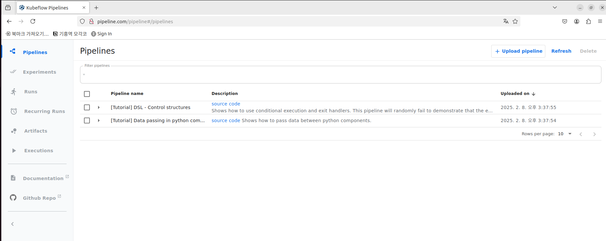
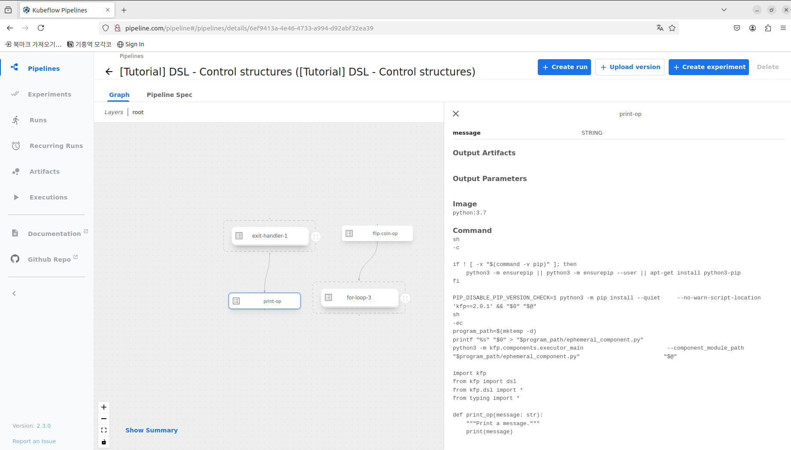
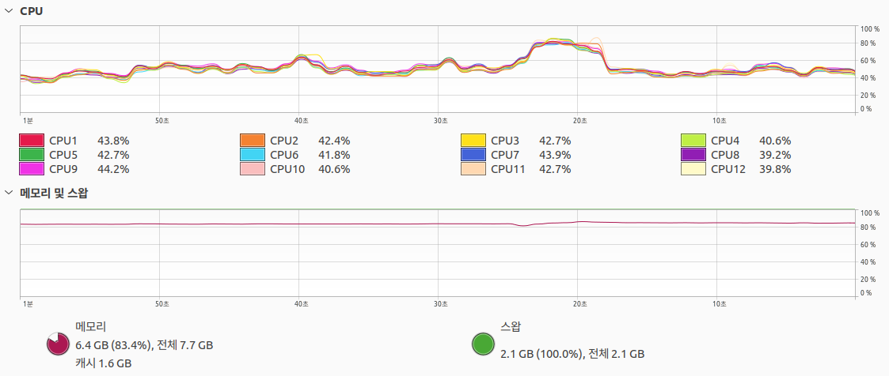

# Pipeline

## Installation Steps (Standalone)

### Apply Manifests

```bash
# https://www.kubeflow.org/docs/components/pipelines/operator-guides/installation/
export PIPELINE_VERSION=2.3.0
kubectl apply -k "github.com/kubeflow/pipelines/manifests/kustomize/cluster-scoped-resources?ref=$PIPELINE_VERSION"
kubectl wait --for condition=established --timeout=60s crd/applications.app.k8s.io
kubectl apply -k "github.com/kubeflow/pipelines/manifests/kustomize/env/dev?ref=$PIPELINE_VERSION"
```

### Check Objects

```bash
$ k get all -n kubeflow
NAME                                                   READY   STATUS    RESTARTS       AGE
pod/cache-deployer-deployment-5574f9d494-fs6hk         1/1     Running   2 (92s ago)    15m
pod/cache-server-864bfdbcfd-qp2q2                      1/1     Running   2 (92s ago)    15m
pod/controller-manager-57488687d6-vqh8x                1/1     Running   4 (54s ago)    15m
pod/metadata-envoy-deployment-74dbc5bdcc-qbkhp         1/1     Running   2 (92s ago)    15m
pod/metadata-grpc-deployment-8496ffb98b-r9hdk          1/1     Running   10 (13s ago)   15m
pod/metadata-writer-6864676f6b-k2wqb                   1/1     Running   4 (92s ago)    15m
pod/minio-7c77bc59b8-mkvbk                             1/1     Running   2 (91s ago)    15m
pod/ml-pipeline-bc86746d4-88d22                        1/1     Running   7 (92s ago)    15m
pod/ml-pipeline-persistenceagent-65c5c6dfc5-fxgfx      1/1     Running   4 (92s ago)    15m
pod/ml-pipeline-scheduledworkflow-759ff87cb9-98wr6     1/1     Running   2 (92s ago)    15m
pod/ml-pipeline-ui-84558b44ff-bxd5w                    1/1     Running   3 (81s ago)    15m
pod/ml-pipeline-viewer-crd-7c74889db4-xjfzq            1/1     Running   2 (92s ago)    15m
pod/ml-pipeline-visualizationserver-68b76fd5b6-rjczl   1/1     Running   2 (82s ago)    15m
pod/mysql-758cd66576-bkpqv                             1/1     Running   2 (90s ago)    15m
pod/proxy-agent-64fbbbf96f-l8x6j                       1/1     Running   7 (40s ago)    15m
pod/workflow-controller-7fcd696bb4-2wwnb               1/1     Running   6 (54s ago)    15m

NAME                                      TYPE        CLUSTER-IP       EXTERNAL-IP   PORT(S)             AGE
service/cache-server                      ClusterIP   10.100.171.30    <none>        443/TCP             15m
service/controller-manager-service        ClusterIP   10.100.253.106   <none>        443/TCP             15m
service/metadata-envoy-service            ClusterIP   10.111.163.231   <none>        9090/TCP            15m
service/metadata-grpc-service             ClusterIP   10.110.1.110     <none>        8080/TCP            15m
service/minio-service                     ClusterIP   10.103.171.9     <none>        9000/TCP            15m
service/ml-pipeline                       ClusterIP   10.102.127.219   <none>        8888/TCP,8887/TCP   15m
service/ml-pipeline-ui                    ClusterIP   10.98.210.222    <none>        80/TCP              15m
service/ml-pipeline-visualizationserver   ClusterIP   10.97.29.16      <none>        8888/TCP            15m
service/mysql                             ClusterIP   10.97.168.67     <none>        3306/TCP            15m

NAME                                              READY   UP-TO-DATE   AVAILABLE   AGE
deployment.apps/cache-deployer-deployment         1/1     1            1           15m
deployment.apps/cache-server                      1/1     1            1           15m
deployment.apps/controller-manager                1/1     1            1           15m
deployment.apps/metadata-envoy-deployment         1/1     1            1           15m
deployment.apps/metadata-grpc-deployment          1/1     1            1           15m
deployment.apps/metadata-writer                   1/1     1            1           15m
deployment.apps/minio                             1/1     1            1           15m
deployment.apps/ml-pipeline                       1/1     1            1           15m
deployment.apps/ml-pipeline-persistenceagent      1/1     1            1           15m
deployment.apps/ml-pipeline-scheduledworkflow     1/1     1            1           15m
deployment.apps/ml-pipeline-ui                    1/1     1            1           15m
deployment.apps/ml-pipeline-viewer-crd            1/1     1            1           15m
deployment.apps/ml-pipeline-visualizationserver   1/1     1            1           15m
deployment.apps/mysql                             1/1     1            1           15m
deployment.apps/proxy-agent                       1/1     1            1           15m
deployment.apps/workflow-controller               1/1     1            1           15m

NAME                                                         DESIRED   CURRENT   READY   AGE
replicaset.apps/cache-deployer-deployment-5574f9d494         1         1         1       15m
replicaset.apps/cache-server-864bfdbcfd                      1         1         1       15m
replicaset.apps/controller-manager-57488687d6                1         1         1       15m
replicaset.apps/metadata-envoy-deployment-74dbc5bdcc         1         1         1       15m
replicaset.apps/metadata-grpc-deployment-8496ffb98b          1         1         1       15m
replicaset.apps/metadata-writer-6864676f6b                   1         1         1       15m
replicaset.apps/minio-7c77bc59b8                             1         1         1       15m
replicaset.apps/ml-pipeline-bc86746d4                        1         1         1       15m
replicaset.apps/ml-pipeline-persistenceagent-65c5c6dfc5      1         1         1       15m
replicaset.apps/ml-pipeline-scheduledworkflow-759ff87cb9     1         1         1       15m
replicaset.apps/ml-pipeline-ui-84558b44ff                    1         1         1       15m
replicaset.apps/ml-pipeline-viewer-crd-7c74889db4            1         1         1       15m
replicaset.apps/ml-pipeline-visualizationserver-68b76fd5b6   1         1         1       15m
replicaset.apps/mysql-758cd66576                             1         1         1       15m
replicaset.apps/proxy-agent-64fbbbf96f                       1         1         1       15m
replicaset.apps/workflow-controller-7fcd696bb4               1         1         1       15m
```

### Access Pipleline UI





## Issue

### *Pipeline Standalone 구축으로 인한 리소스 부족




## Reference

https://www.kubeflow.org/docs/components/pipelines/operator-guides/installation/