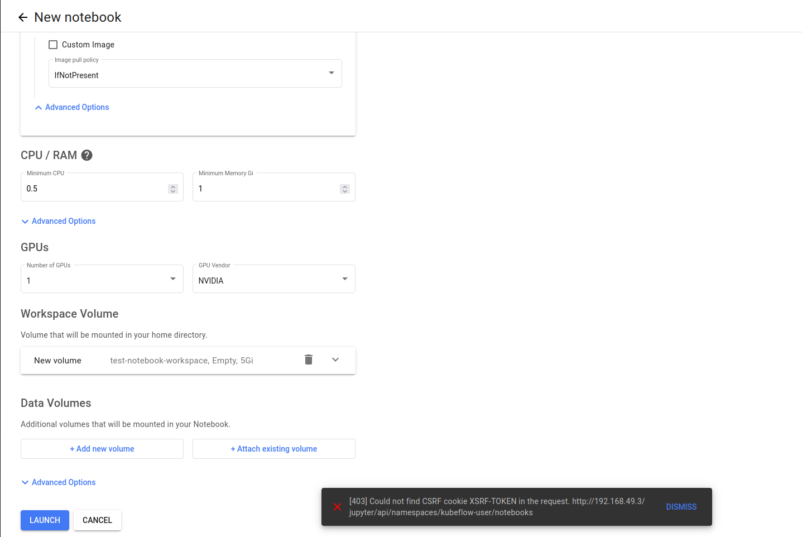

# Jupyter Web App XSRF-TOKEN

## 문제 상황 



- Jupyter Notebook Server 생성(LAUNCH) 시, CSRF-TOKEN 미인증 발생

## 해결 단계

### 1. Jupyter Web App Deployment 조회

```bash
$ k get deploy -n kubeflow
NAME                             READY   UP-TO-DATE   AVAILABLE   AGE
jupyter-web-app-deployment       1/1     1            1           4d6h
notebook-controller-deployment   1/1     1            1           4d7h
```

```bash
$ k get deployment jupyter-web-app-deployment -n kubeflow -o yaml
apiVersion: apps/v1
kind: Deployment
metadata:
  annotations:
    deployment.kubernetes.io/revision: "1"
    kubectl.kubernetes.io/last-applied-configuration: |
      {"apiVersion":"apps/v1","kind":"Deployment","metadata":{"annotations":{},"labels":{"app":"jupyter-web-app","kustomize.component":"jupyter-web-app"},"name":"jupyter-web-app-deployment","namespace":"kubeflow"},"spec":{"replicas":1,"selector":{"matchLabels":{"app":"jupyter-web-app","kustomize.component":"jupyter-web-app"}},"template":{"metadata":{"labels":{"app":"jupyter-web-app","kustomize.component":"jupyter-web-app"}},"spec":{"containers":[{"env":[{"name":"APP_PREFIX","value":"/jupyter"},{"name":"UI","value":"default"},{"name":"USERID_HEADER","value":"kubeflow-userid"},{"name":"USERID_PREFIX","value":""},{"name":"APP_SECURE_COOKIES","value":"true"}],"image":"docker.io/kubeflownotebookswg/jupyter-web-app:v1.9.2","name":"jupyter-web-app","ports":[{"containerPort":5000}],"volumeMounts":[{"mountPath":"/etc/config","name":"config-volume"},{"mountPath":"/src/apps/default/static/assets/logos","name":"logos-volume"}]}],"serviceAccountName":"jupyter-web-app-service-account","volumes":[{"configMap":{"name":"jupyter-web-app-config-tk56dhd26b"},"name":"config-volume"},{"configMap":{"name":"jupyter-web-app-logos"},"name":"logos-volume"}]}}}}
  creationTimestamp: "2025-01-25T02:22:11Z"
  generation: 1
  labels:
    app: jupyter-web-app
    kustomize.component: jupyter-web-app
  name: jupyter-web-app-deployment
  namespace: kubeflow
  resourceVersion: "86013"
  uid: 61a69456-3db7-4aec-ac7c-16a57da68037
spec:
  progressDeadlineSeconds: 600
  replicas: 1
  revisionHistoryLimit: 10
  selector:
    matchLabels:
      app: jupyter-web-app
      kustomize.component: jupyter-web-app
  strategy:
    rollingUpdate:
      maxSurge: 25%
      maxUnavailable: 25%
    type: RollingUpdate
  template:
    metadata:
      creationTimestamp: null
      labels:
        app: jupyter-web-app
        kustomize.component: jupyter-web-app
    spec:
      containers:
      - env:
        - name: APP_PREFIX
          value: /jupyter
        - name: UI
          value: default
        - name: USERID_HEADER
          value: kubeflow-userid
        - name: USERID_PREFIX
        - name: APP_SECURE_COOKIES
          value: "true"
        image: docker.io/kubeflownotebookswg/jupyter-web-app:v1.9.2
        imagePullPolicy: IfNotPresent
        name: jupyter-web-app
        ports:
        - containerPort: 5000
          protocol: TCP
        resources: {}
        terminationMessagePath: /dev/termination-log
        terminationMessagePolicy: File
        volumeMounts:
        - mountPath: /etc/config
          name: config-volume
        - mountPath: /src/apps/default/static/assets/logos
          name: logos-volume
      dnsPolicy: ClusterFirst
      restartPolicy: Always
      schedulerName: default-scheduler
      securityContext: {}
      serviceAccount: jupyter-web-app-service-account
      serviceAccountName: jupyter-web-app-service-account
      terminationGracePeriodSeconds: 30
      volumes:
      - configMap:
          defaultMode: 420
          name: jupyter-web-app-config-tk56dhd26b
        name: config-volume
      - configMap:
          defaultMode: 420
          name: jupyter-web-app-logos
        name: logos-volume
status:
  availableReplicas: 1
  conditions:
  - lastTransitionTime: "2025-01-25T02:22:12Z"
    lastUpdateTime: "2025-01-25T02:22:24Z"
    message: ReplicaSet "jupyter-web-app-deployment-7dbcd448fb" has successfully progressed.
    reason: NewReplicaSetAvailable
    status: "True"
    type: Progressing
  - lastTransitionTime: "2025-01-29T07:19:08Z"
    lastUpdateTime: "2025-01-29T07:19:08Z"
    message: Deployment has minimum availability.
    reason: MinimumReplicasAvailable
    status: "True"
    type: Available
  observedGeneration: 1
  readyReplicas: 1
  replicas: 1
  updatedReplicas: 1
```

### 2. CSRF-TOKEN 미인증 설정

```bash
# 설정 변경
# - name: APP_SECURE_COOKIES
#    value: "false"
$ k edit deployment jupyter-web-app-deployment -n kubeflow
deployment.apps/jupyter-web-app-deployment edited
```

## 확인

```bash
# Deployment 재배포 후, CSRF TOKEN 미적용 확인
$ k get pods -n kubeflow
NAME                                              READY   STATUS    RESTARTS        AGE
jupyter-web-app-deployment-d68bd54dc-xwvsv        2/2     Running   0               3m57s
notebook-controller-deployment-6545dbccf4-b6ljq   2/2     Running   38 (124m ago)   4d7h

```