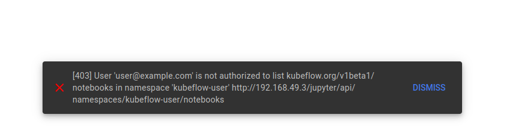

# Jupyter Web App RBAC (Profile)

## 문제 상황


```log
2025-01-29 07:37:08,951 | kubeflow.kubeflow.crud_backend.authn | INFO | Handling request for user: user@example.com
2025-01-29 07:37:08,951 | kubeflow.kubeflow.crud_backend.csrf | INFO | Skipping CSRF check for safe method: GET
2025-01-29 07:37:08,952 | kubeflow.kubeflow.crud_backend.serving | INFO | Serving index.html for path: roboto-latin-normal400.465390c6e54c60f4a15f.woff2
2025-01-29 07:37:08,952 | kubeflow.kubeflow.crud_backend.helpers | INFO | Setting the <base> to reflect the prefix: /jupyter/
127.0.0.6 - - [29/Jan/2025:07:37:08 +0000] "GET /roboto-latin-normal400.465390c6e54c60f4a15f.woff2 HTTP/1.1" 200 7151 "http://192.168.49.3/jupyter/" "Mozilla/5.0 (X11; Ubuntu; Linux x86_64; rv:134.0) Gecko/20100101 Firefox/134.0"
2025-01-29 07:37:09,095 | kubeflow.kubeflow.crud_backend.authn | INFO | Handling request for user: user@example.com
2025-01-29 07:37:09,095 | kubeflow.kubeflow.crud_backend.csrf | INFO | Skipping CSRF check for safe method: GET
2025-01-29 07:37:09,238 | kubeflow.kubeflow.crud_backend.errors.handlers | ERROR | HTTP Exception handled: 403 Forbidden: User 'user@example.com' is not authorized to list kubeflow.org/v1beta1/notebooks in namespace 'kubeflow-user'
127.0.0.6 - - [29/Jan/2025:07:37:09 +0000] "GET /api/namespaces/kubeflow-user/notebooks HTTP/1.1" 403 175 "http://192.168.49.3/jupyter/" "Mozilla/5.0 (X11; Ubuntu; Linux x86_64; rv:134.0) Gecko/20100101 Firefox/134.0"
```

## 해결 단계

### 1. 기존 Profile 확인 및 삭제

```bash
# Profile의 User name은 Dex id와 일치하게 배포
$ k get profile kubeflow-user-example-com -n kubeflow -o yaml
apiVersion: kubeflow.org/v1
kind: Profile
metadata:
  annotations:
    kubectl.kubernetes.io/last-applied-configuration: |
      {"apiVersion":"kubeflow.org/v1beta1","kind":"Profile","metadata":{"name":"kubeflow-user-example-com"},"spec":{"owner":{"kind":"User","name":"user@example.com"}}}
  creationTimestamp: "2025-01-22T11:00:41Z"
  generation: 1
  name: kubeflow-user-example-com
  resourceVersion: "26355"
  uid: e6f50d88-e389-41d6-afaa-68a05b5f89cb
spec:
  owner:
    kind: User
    name: user@example.com
```

```bash
# 기존 profile을 삭제
$ k get profile -A
NAME                        AGE
kubeflow-user-example-com   6d21h
$ k delete profile kubeflow-user-example-com
profile.kubeflow.org "kubeflow-user-example-com" deleted
k get profile -A
No resources found

```

### 2. 'Jupyter Web App' Clusterrole 확인

```bash
# jupyter web app의 모든 clusterrole 조회
$ k get clusterrole -n kubeflow | grep jupyter
jupyter-web-app-cluster-role                                           2025-01-22T10:59:45Z
jupyter-web-app-kubeflow-notebook-ui-admin                             2025-01-22T10:59:45Z
jupyter-web-app-kubeflow-notebook-ui-edit                              2025-01-22T10:59:45Z
jupyter-web-app-kubeflow-notebook-ui-view                              2025-01-22T10:59:45Z
```

```bash
# 'jupyter-web-app-cluster-role' clusterrole
# 'jupyter-web-app-service-account' service account가 사용
(base) jmlim@jmlim-Lenovo-Legion-5-15ARH05:~$ k get clusterrolebinding jupyter-web-app-cluster-role-binding -n kubeflow -o yaml
apiVersion: rbac.authorization.k8s.io/v1
kind: ClusterRoleBinding
metadata:
  annotations:
    kubectl.kubernetes.io/last-applied-configuration: |
      {"apiVersion":"rbac.authorization.k8s.io/v1","kind":"ClusterRoleBinding","metadata":{"annotations":{},"labels":{"app":"jupyter-web-app","kustomize.component":"jupyter-web-app"},"name":"jupyter-web-app-cluster-role-binding"},"roleRef":{"apiGroup":"rbac.authorization.k8s.io","kind":"ClusterRole","name":"jupyter-web-app-cluster-role"},"subjects":[{"kind":"ServiceAccount","name":"jupyter-web-app-service-account","namespace":"kubeflow"}]}
  creationTimestamp: "2025-01-22T10:59:46Z"
  labels:
    app: jupyter-web-app
    kustomize.component: jupyter-web-app
  name: jupyter-web-app-cluster-role-binding
  resourceVersion: "47042"
  uid: 7df0bf3e-5611-4ae4-89fb-b19dcec89ba4
roleRef:
  apiGroup: rbac.authorization.k8s.io
  kind: ClusterRole
  name: jupyter-web-app-cluster-role
subjects:
- kind: ServiceAccount
  name: jupyter-web-app-service-account
  namespace: kubeflow
```

```bash
# 'jupyter-web-app-kubeflow-notebook-ui-admin' clusterrole
# rules 정의가 안되어있어 '***-edit' clusterrole을 활용 
k get clusterrole jupyter-web-app-kubeflow-notebook-ui-admin -n kubeflow -o yaml
apiVersion: rbac.authorization.k8s.io/v1
kind: ClusterRole
metadata:
  annotations:
    kubectl.kubernetes.io/last-applied-configuration: |
      {"apiVersion":"rbac.authorization.k8s.io/v1","kind":"ClusterRole","metadata":{"annotations":{},"labels":{"app":"jupyter-web-app","kustomize.component":"jupyter-web-app","rbac.authorization.kubeflow.org/aggregate-to-kubeflow-admin":"true"},"name":"jupyter-web-app-kubeflow-notebook-ui-admin"},"rules":[]}
  creationTimestamp: "2025-01-22T10:59:45Z"
  labels:
    app: jupyter-web-app
    kustomize.component: jupyter-web-app
    rbac.authorization.kubeflow.org/aggregate-to-kubeflow-admin: "true"
  name: jupyter-web-app-kubeflow-notebook-ui-admin
  resourceVersion: "47038"
  uid: 4257b80a-4504-412c-a726-5a5529fc3f74
rules: null
```

```bash
# 'jupyter-web-app-kubeflow-notebook-ui-edit' clusterrole
# 모든 리소스에 대한 권한 존재
k get clusterrole jupyter-web-app-kubeflow-notebook-ui-edit -n kubeflow -o yaml
apiVersion: rbac.authorization.k8s.io/v1
kind: ClusterRole
metadata:
  annotations:
    kubectl.kubernetes.io/last-applied-configuration: |
      {"apiVersion":"rbac.authorization.k8s.io/v1","kind":"ClusterRole","metadata":{"annotations":{},"labels":{"app":"jupyter-web-app","kustomize.component":"jupyter-web-app","rbac.authorization.kubeflow.org/aggregate-to-kubeflow-edit":"true"},"name":"jupyter-web-app-kubeflow-notebook-ui-edit"},"rules":[{"apiGroups":["kubeflow.org"],"resources":["notebooks","notebooks/finalizers","poddefaults"],"verbs":["get","list","create","delete"]}]}
  creationTimestamp: "2025-01-22T10:59:45Z"
  labels:
    app: jupyter-web-app
    kustomize.component: jupyter-web-app
    rbac.authorization.kubeflow.org/aggregate-to-kubeflow-edit: "true"
  name: jupyter-web-app-kubeflow-notebook-ui-edit
  resourceVersion: "47039"
  uid: 0c32aa0d-a8d5-437f-917a-7bbe4faa6390
rules:
- apiGroups:
  - kubeflow.org
  resources:
  - notebooks
  - notebooks/finalizers
  - poddefaults
  verbs:
  - get
  - list
  - create
  - delete
```

### 3. 새 Profile 및 RoleBind 생성

```bash
apiVersion: v1
kind: Namespace
metadata:
  name: kubeflow-user
```

```bash
apiVersion: kubeflow.org/v1
kind: Profile
metadata:
  name: kubeflow-user
spec:
  owner:
    kind: User
    name: user@example.com
```

```bash
apiVersion: rbac.authorization.k8s.io/v1
kind: RoleBinding
metadata:
  name: user-notebook-access
  namespace: kubeflow-user
  annotations:
    role: edit
    user: user@example.com
roleRef:
  apiGroup: rbac.authorization.k8s.io
  kind: ClusterRole
  # name: jupyter-web-app-kubeflow-notebook-ui-edit
  name: kubeflow-edit
subjects:
- apiGroup: rbac.authorization.k8s.io
  kind: User
  name: user@example.com
```

### 4. Default Editor Service Account


## 확인


## 참고

[Kubeflow Profiles and Namespaces](https://www.kubeflow.org/docs/components/central-dash/profiles/)